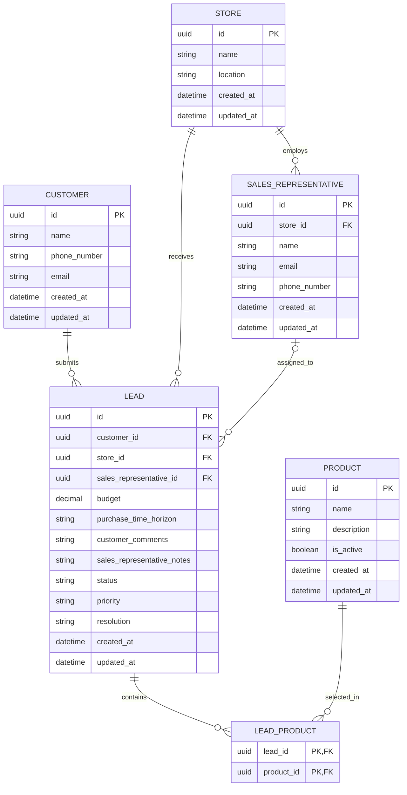

# Database Design

## Initial Implementation Scope

The first implementation checkpoint will focus only on:

1. Creating the customer form
2. Sending the submitted information to the Python REST API
3. Validating the submitted information
4. Storing the information in the database

Authentication, store dashboards, sales representative assignments, WhatsApp integration, automatic prioritization, and lead resolution workflows will be considered future milestones.

## Candidate Entities

### Customer

| Field          | Description                                                         |
| -------------- | ------------------------------------------------------------------- |
| `id`           | Unique customer identifier using a UUID                             |
| `name`         | Customer's full name                                                |
| `phone_number` | Customer's phone number                                             |
| `email`        | Customer's email address                                            |
| `created_at`   | Timestamp indicating when the customer was first registered         |
| `updated_at`   | Timestamp indicating when the customer information was last updated |

#### Relationships

**Customer to Lead: one-to-many**

- The **Customer side is one**: each lead belongs to one customer.
- The **Lead side is many**: one customer can create multiple leads over time.
- This relationship is implemented by storing `customer_id` in the `Lead` table.

---

### Lead

| Field                        | Description                                                                             |
| ---------------------------- | --------------------------------------------------------------------------------------- |
| `id`                         | Unique lead identifier using a UUID                                                     |
| `customer_id`                | Reference to the customer who submitted the lead                                        |
| `store_id`                   | Reference to the store selected by the customer                                         |
| `sales_representative_id`    | Reference to the assigned sales representative; nullable until assignment               |
| `budget`                     | Customer's estimated purchase budget                                                    |
| `purchase_time_horizon`      | Estimated timeframe in which the customer intends to make the purchase                  |
| `customer_comments`          | Additional comments, questions, or requests submitted by the customer                   |
| `sales_representative_notes` | Internal notes added by the assigned sales representative                               |
| `status`                     | Current lead status, such as `new`, `assigned`, `in_progress`, `closed`, or `cancelled` |
| `priority`                   | Lead priority or classification                                                         |
| `resolution`                 | Final result or outcome of the lead; nullable while the lead remains active             |
| `created_at`                 | Timestamp indicating when the lead was created                                          |
| `updated_at`                 | Timestamp indicating when the lead was last updated                                     |

#### Relationships

**Lead to Customer: many-to-one**

- The **Lead side is many**: multiple leads can belong to the same customer.
- The **Customer side is one**: each lead belongs to one customer.

**Lead to Store: many-to-one**

- The **Lead side is many**: a store can receive multiple leads.
- The **Store side is one**: each lead is associated with one selected store.

**Lead to Sales Representative: many-to-one**

- The **Lead side is many**: one sales representative can be responsible for multiple leads.
- The **Sales Representative side is one**: each lead can have one assigned sales representative at a time.
- The relationship is optional until the lead is assigned.

**Lead to Product: many-to-many**

- The **Lead side is many**: one product can appear in multiple leads.
- The **Product side is also many**: one lead can include multiple products of interest.
- This relationship requires the `LeadProduct` association table.

---

### Store

| Field        | Description                                                      |
| ------------ | ---------------------------------------------------------------- |
| `id`         | Unique store identifier using a UUID                             |
| `name`       | Store name                                                       |
| `location`   | Store location or address                                        |
| `created_at` | Timestamp indicating when the store was registered               |
| `updated_at` | Timestamp indicating when the store information was last updated |

#### Relationships

**Store to Lead: one-to-many**

- The **Store side is one**: each lead is associated with one store.
- The **Lead side is many**: one store can receive multiple leads.
- This relationship is implemented by storing `store_id` in the `Lead` table.

**Store to Sales Representative: one-to-many**

- The **Store side is one**: each sales representative belongs to one store.
- The **Sales Representative side is many**: one store can have multiple sales representatives.
- This relationship is implemented by storing `store_id` in the `SalesRepresentative` table.

---

### Sales Representative

| Field          | Description                                                                     |
| -------------- | ------------------------------------------------------------------------------- |
| `id`           | Unique sales representative identifier using a UUID                             |
| `store_id`     | Reference to the store where the sales representative works                     |
| `name`         | Sales representative's full name                                                |
| `email`        | Sales representative's email address                                            |
| `phone_number` | Sales representative's phone number                                             |
| `created_at`   | Timestamp indicating when the sales representative was registered               |
| `updated_at`   | Timestamp indicating when the sales representative information was last updated |

#### Relationships

**Sales Representative to Store: many-to-one**

- The **Sales Representative side is many**: multiple sales representatives can belong to the same store.
- The **Store side is one**: each sales representative belongs to one store.

**Sales Representative to Lead: one-to-many**

- The **Sales Representative side is one**: each assigned lead has one sales representative at a time.
- The **Lead side is many**: one sales representative can manage multiple leads.
- This relationship is implemented by storing `sales_representative_id` in the `Lead` table.

---

### Product

| Field         | Description                                                                  |
| ------------- | ---------------------------------------------------------------------------- |
| `id`          | Unique product identifier using a UUID                                       |
| `name`        | General product name or category, such as `bed`, `table`, `chair`, or `sofa` |
| `description` | Optional description of the product category                                 |
| `is_active`   | Indicates whether the product can currently be selected in the customer form |
| `created_at`  | Timestamp indicating when the product was registered                         |
| `updated_at`  | Timestamp indicating when the product information was last updated           |

#### Relationships

**Product to Lead: many-to-many**

- The **Product side is many**: one lead can contain multiple products.
- The **Lead side is also many**: one product can be associated with multiple leads.
- This relationship is implemented through the `LeadProduct` association table.

---

### Lead Product

The `LeadProduct` entity is an association table used to represent the many-to-many relationship between leads and products.

| Field        | Description            |
| ------------ | ---------------------- |
| `lead_id`    | Reference to a lead    |
| `product_id` | Reference to a product |

#### Relationships

**LeadProduct to Lead: many-to-one**

- The **LeadProduct side is many**: one lead can have multiple entries in the association table.
- The **Lead side is one**: each `LeadProduct` record references one lead.

**LeadProduct to Product: many-to-one**

- The **LeadProduct side is many**: one product can have multiple entries in the association table.
- The **Product side is one**: each `LeadProduct` record references one product.

Together, these two many-to-one relationships create the many-to-many relationship between `Lead` and `Product`.

## Relationship Summary

| First Entity         | Relationship | Second Entity        | Explicit Cardinality                                                                                  |
| -------------------- | ------------ | -------------------- | ----------------------------------------------------------------------------------------------------- |
| Customer             | One-to-many  | Lead                 | One customer can have many leads; each lead has one customer                                          |
| Store                | One-to-many  | Lead                 | One store can have many leads; each lead has one store                                                |
| Store                | One-to-many  | Sales Representative | One store can have many sales representatives; each sales representative has one store                |
| Sales Representative | One-to-many  | Lead                 | One sales representative can have many leads; each assigned lead has zero or one sales representative |
| Lead                 | Many-to-many | Product              | One lead can have many products, and one product can appear in many leads                             |
| Lead                 | One-to-many  | LeadProduct          | One lead can have many association records; each association record has one lead                      |
| Product              | One-to-many  | LeadProduct          | One product can have many association records; each association record has one product                |

### High-Level Entity Relationship Diagram

The following diagram represents the proposed high-level database design.

Some entities and relationships are included to document the broader system vision and may not be implemented during the initial milestone.

